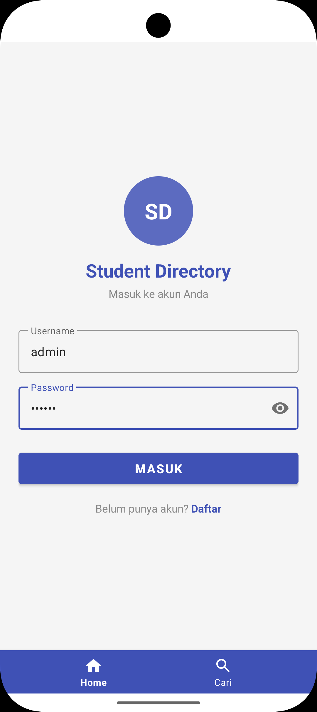
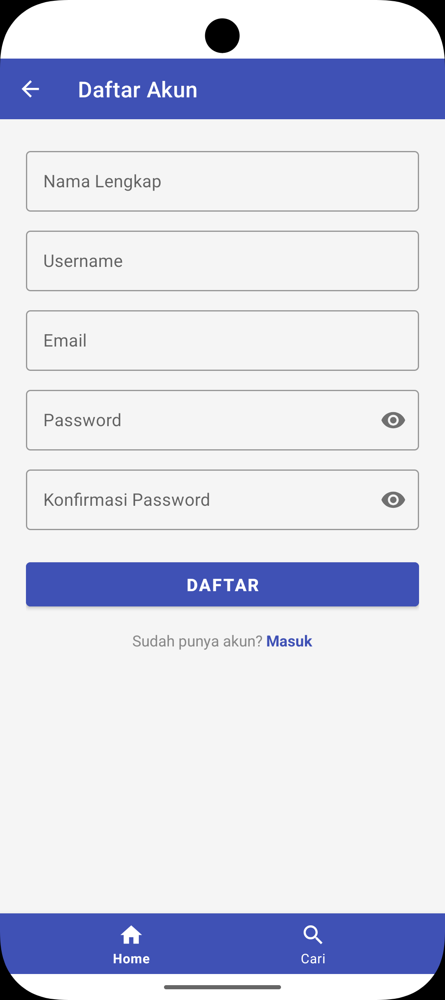
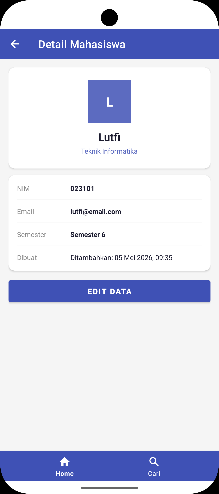
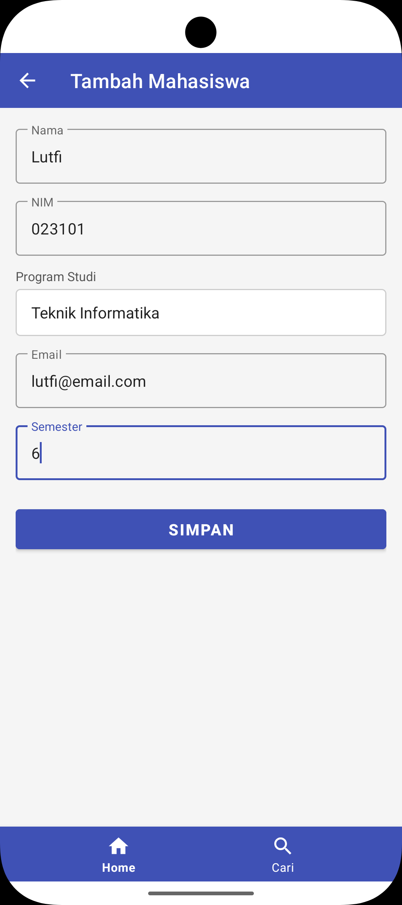
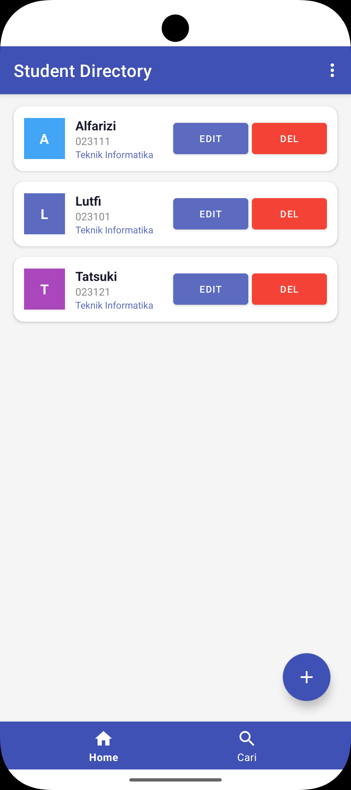
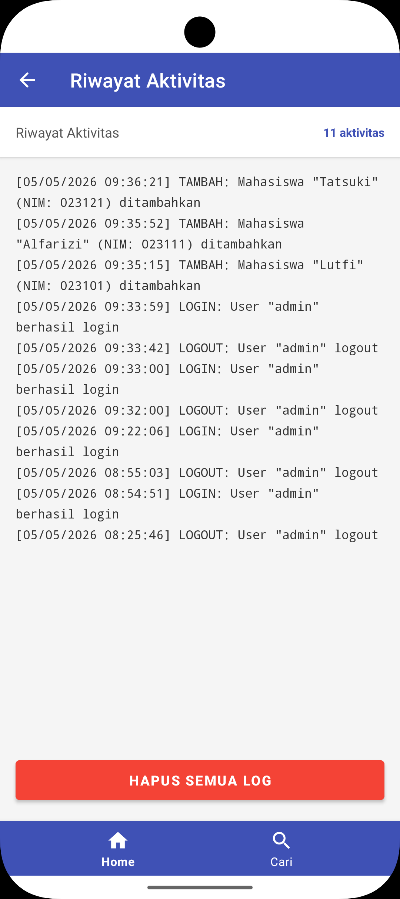

#### Nama  : Lutfi Alfarizi
#### NIM   : F1D02310121

# Room Database - CRUD Mahasiswa

A. Aplikasi Student Directory ini merupakan aplikasi berbasis kotlin yang digunakan untuk melakukan CRUD data mahasiswa dengan beberapa fitur utama seperti
1. Menambah data mahasiswa
2. Mengubah data mahasiswa
3. Menghapus data mahasiswa
4. Mengurutkan data mahasiswa
5. Registrasi dan login
6. Riwayat aktivitas

##### B. Metode penyimpanan yang digunakan
1. Room Database digunakan untuk menyimpan CRUD data mahasiswa dan User Login/Daftar
2. SharedPreferences digunakan untuk Sort Order dan Session login
3. Internal Storage digunakan untuk menyimpan Log Aktivitas

##### C. Screeshots Aplikasi Student Directory

